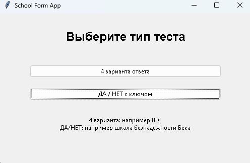
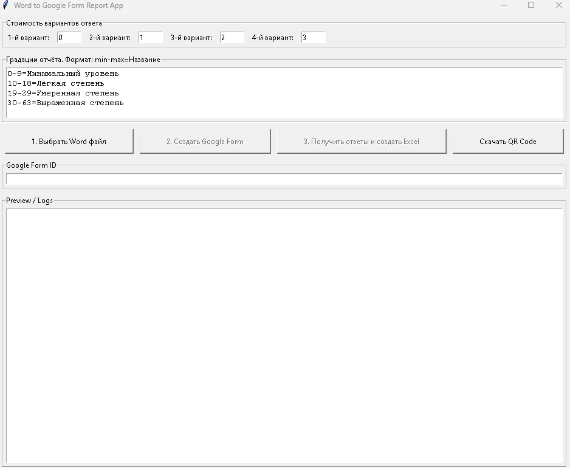
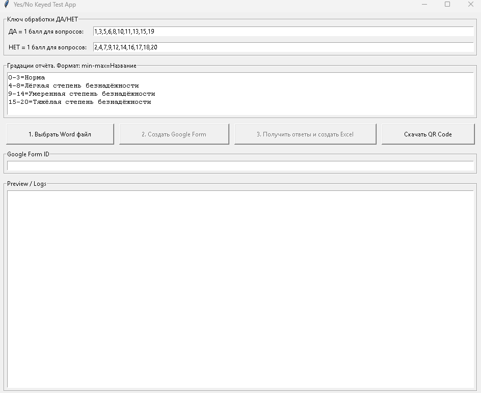

# Word to Google Form

Word to Google Form is a desktop Python application that turns Word-based tests into Google Forms, collects student responses, grades them, and exports Excel reports. It is designed for educational and clinical questionnaires where the test content is stored in a Word document and the scoring logic must be applied automatically.

## What the app does

The application supports two workflows:

- Four-option tests, such as psychological or educational questionnaires with scored answer choices.
- Yes/No keyed questionnaires, where the scorer defines which questions contribute points for "Yes" and which contribute points for "No".

Once the test is imported, the app can:

- Parse questions and answer options from a Word document.
- Create a Google Form from the parsed content.
- Save an answer key for later grading.
- Download and normalize Google Form responses.
- Grade responses against the saved answer key.
- Generate Excel summary and detailed reports.
- Create a QR code for the form responder link.

## How the app works

### 1. Start the application
Run the app from the project root:

```bash
python main.py
```

You will see a start window with two options:

- Four answer options
- Yes/No keyed questionnaire



### 2. Choose a test type
The app offers two modes:

1. Four-option mode
   - Best for tests where each question has four answer choices.
   - The user can assign numeric scores to each option.
   - Thresholds can be configured to label the final score range.
   

2. Yes/No keyed mode
   - Best for questionnaires such as the Beck Hopelessness Scale.
   - The user specifies which question numbers count as one point for "Yes" and which count as one point for "No".
   - Thresholds can be configured to classify the final result.



### 3. Import a Word document
The app opens a Word file using the Tkinter file picker. The parser reads the document and extracts:

- the test title,
- numbered questions,
- answer options,
- scoring information or key definitions.

### 4. Create a Google Form
After the file is parsed, the app authenticates with Google and creates a Google Form. The generated form includes:


- a student or respondent identifier field,
- the parsed questions,
- the answer choices defined in the Word file.

The app also saves an answer key JSON file for later grading.

### 5. Share the form and collect responses
Once the form is created, the responder link can be shared. The app can also generate a QR code for that link.

### 6. Download responses and generate reports
When responses are available, the user enters the Google Form ID and launches the report workflow. The app:

- authenticates with Google again,
- downloads the form responses,
- normalizes the response data,
- grades them against the saved answer key,
- creates Excel reports in a selected folder.

## Input format specification

### Four-option mode
The Word document should use a simple structure:

- A title or introductory text at the top.
- Questions written as numbered items such as `1. Question text`.
- Each question followed by four answer options.
- Optional instructions before the first question.
- The parser stops when it reaches a line beginning with `подсчет результатов`.

### Yes/No keyed mode
The Word document should follow the same question structure, but the app also uses the key values entered in the GUI:

- Questions listed in the "YES = 1 point" field count as one point for Yes.
- Questions listed in the "NO = 1 point" field count as one point for No.
- The two sets must not overlap.

## Installation

Install the required Python dependencies:

```bash
python -m pip install -r requirements.txt
```

Required packages include:

- python-docx
- google-api-python-client
- google-auth-oauthlib
- google-auth
- openpyxl
- qrcode[pil]

## Google API setup

1. Create a Google Cloud project.
2. Enable the Google Forms API.
3. Create OAuth 2.0 client credentials.
4. Download `credentials.json` and place it in the project root.
5. Run the app once so Google OAuth can complete and create `token.json`.

## Output files

The app creates the following files during normal use:

- `answer_key_<form_id>.json` — saved answer key
- `responses_normalized.json` — normalized response data
- `graded_results.json` — scored results
- Excel reports in the chosen output folder:
  - `report.xlsx`
  - `detailed_report.xlsx`
- `qr_code_<form_id>.png` — QR code for the form link

## Screenshots

This section collects the same images in one place for quick reference:


## Project structure

- `main.py` — application entry point
- `requirements.txt` — Python dependencies
- `credentials.json` / `token.json` — Google OAuth credentials and token(added to gitignore)
- `school_form_app/ui/` — Tkinter desktop user interfaces
- `school_form_app/parsing/` — Word document parsing logic
- `school_form_app/google_api/` — Google Forms authentication and API integration
- `school_form_app/reports/` — answer-key saving, grading, and Excel export
- `school_form_app/models.py` — data structures used by the app
- `*.docx` - word documents as a template 

## Notes

- Keep `*.json` private and do not commit it.
- If parsing fails, confirm that the Word file follows the expected numbering and option format.
- The GUI supports custom scoring and grading thresholds for different assessment scales.
